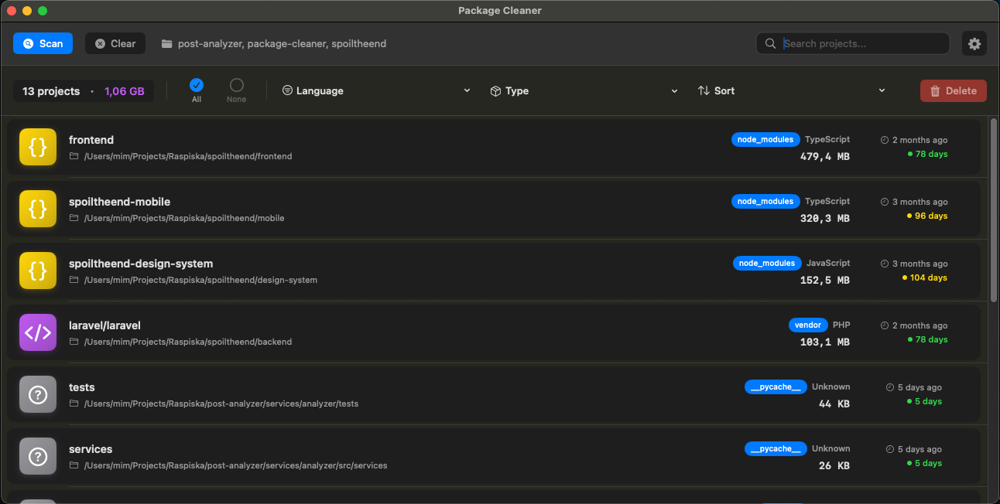
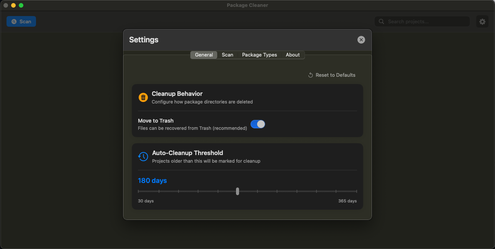

# Package Cleaner

[](https://github.com/Raspiska-Ltd/package-cleaner/actions/workflows/build.yml)
[](https://github.com/Raspiska-Ltd/package-cleaner/releases)
[](LICENSE)
[](https://www.apple.com/macos)
[](https://swift.org)

A native macOS application that helps developers reclaim disk space by finding and removing package dependency directories like `node_modules`, `vendor`, and more.

<p align="center">
  
</p>

## ✨ Features

- 🔍 **Smart Detection** - Finds package directories across multiple languages and frameworks
- 📊 **Project Insights** - Shows project metadata, last activity, and disk usage
- 🎯 **Flexible Filtering** - Filter by language, type, age, or search by name
- 🗑️ **Safe Cleanup** - Moves to Trash by default for easy recovery
- 🔒 **Privacy First** - 100% offline, no telemetry, no data collection
- ⚡ **Native Performance** - Built with Swift and SwiftUI for macOS

## 📸 Screenshots

<details>
<summary>View Screenshots</summary>

### Search & Filter


### Settings


</details>

## 🗂️ Supported Package Types

| Directory | Language/Framework |
|-----------|-------------------|
| `node_modules` | Node.js, JavaScript, TypeScript |
| `vendor` | PHP (Composer), Go, Ruby (Bundler) |
| `.gradle`, `build` | Java, Kotlin, Android (Gradle) |
| `target` | Rust (Cargo), Java (Maven) |
| `Pods` | iOS, macOS (CocoaPods) |
| `venv`, `.venv`, `__pycache__` | Python |
| `packages` | .NET (NuGet) |
| `.pub-cache` | Dart, Flutter |

## 📋 Requirements

- macOS 12.0 (Monterey) or later
- Xcode 15.0+ (for building from source)

## 🚀 Installation

### Download (Recommended)

1. Download the latest `Package.Cleaner.zip` from [Releases](https://github.com/Raspiska-Ltd/package-cleaner/releases)
2. Unzip and move `Package Cleaner.app` to `/Applications`
3. Right-click the app and select "Open" on first launch

### Build from Source

```bash
git clone git@github.com:Raspiska-Ltd/package-cleaner.git
cd package-cleaner
swift build -c release
./scripts/build-app.sh
```

## 💡 Quick Start

1. **Add Scan Directories** - Open Settings (⌘,) and add directories like `~/Projects` or `~/Developer`
2. **Scan** - Click Scan (⌘R) to find package directories
3. **Filter & Sort** - Use filters and search to find what you need
4. **Cleanup** - Select directories and delete (⌘⌫) to reclaim space

### Keyboard Shortcuts

| Shortcut | Action |
|----------|--------|
| `⌘R` | Start scan |
| `⌘F` | Focus search |
| `⌘A` | Select all |
| `⌘⌫` | Delete selected |
| `⌘,` | Open settings |

## 📚 Documentation

- [Architecture](docs/ARCHITECTURE.md) - Technical design and decisions
- [Requirements](docs/REQUIREMENTS.md) - Detailed specifications
- [Roadmap](docs/ROADMAP.md) - Future plans and milestones
- [Contributing](docs/CONTRIBUTING.md) - Contribution guidelines

## 🤝 Contributing

Contributions are welcome! Please read the [Contributing Guide](docs/CONTRIBUTING.md) before submitting a pull request.

## 📄 License

MIT License - see [LICENSE](LICENSE) for details.

## 🏢 About

Developed by [Raspiska Ltd](https://raspiska.co?utm_source=github&utm_medium=readme&utm_campaign=package-cleaner) - Building developer tools and productivity applications.

**Links:** [Website](https://raspiska.co) • [Issues](https://github.com/Raspiska-Ltd/package-cleaner/issues) • [Releases](https://github.com/Raspiska-Ltd/package-cleaner/releases)

---

<sub>Inspired by npkill, built as a native macOS app with broader language support and modern UI.</sub>
